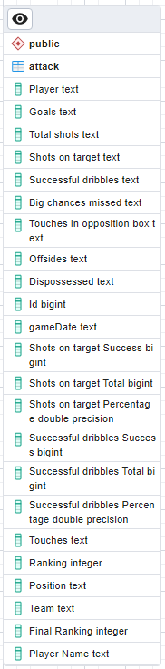
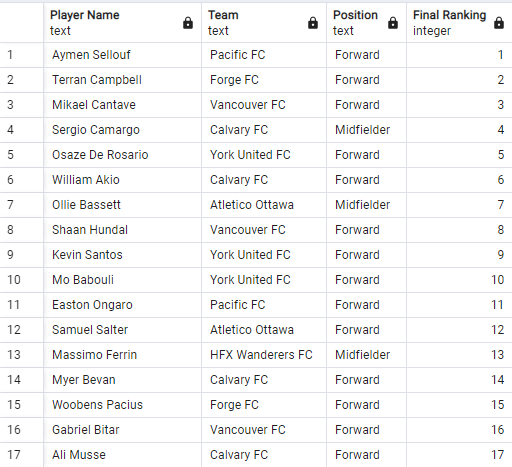

# Capstone Project
# Data-driven insights: identifying the best soccer players by position

## Introduction

This data-centric project delves into an in-depth analysis of soccer player data, specifically honing in on the assessment of attacking skills. Employing advanced data analysis techniques and classification algorithms, the primary objective of the project is to pinpoint top-tier players based on their distinctive attributes. By scrutinizing position-specific proficiency within the sport, the project aims to provide valuable insights into the players' prowess in offensive aspects of the game.

The dataset utilized for this project comprises [Fotmob](https://www.fotmob.com/) statistics from the [Canadian Premier League](https://canpl.ca/statistics/players/2023/) during the 2023 season, encompassing a total of 116 games played from April to October. Fotmob's comprehensive statistical breakdown includes key performance indicators such as Top Stats, Attack, Passes, Defense, Duels, and Goalkeeping.

To ensure a comprehensive analysis, player information was sourced from the official Canadian Premier League website, comprising a roster of 187 players actively participating in the league during the specified timeframe.

This investigation specifically centers on the Attack statistics as a focal point for evaluating player performance and skill in the Canadian Premier League of 2023.

## Process

To facilitate data extraction, I developed a code designed to parse HTML files and extract players' statistics from each game. Following this, a meticulous cleaning process was applied to enhance the data's integrity. The refined dataset was subsequently stored in a database, where I conducted thorough queries to verify and validate its consistency.

With a robust and consistent dataset in place, I proceeded to implement a RandomForestClassifier algorithm through code execution. This enabled the identification of standout players on a monthly basis, with a specific emphasis on assessing their attacking skills. The ultimate goal was to pinpoint the best player for each month and, cumulatively, determine the best player of the season based on their prowess in attacking aspects of the game.

## Cleaning data

Addressing the challenge of inconsistent player names displayed by Fotmob, where variations such as "D. Klomp" and "Daan Klomp" were encountered, a comprehensive solution involved identifying all distinct names for each player and assigning a unique identifier (Id) to standardize their representation. For goalkeepers, a uniform Id of -1 was established, and their data was subsequently disregarded.

Another complexity arose from variations in the availability of Attack skills statistics for different games. Certain metrics, such as "Touches in opposition box," were present in some games but absent in others. To address this, I meticulously identified all potential statistics and stored them in the database.

Additionally, certain Attack stats presented concatenated information, requiring a separation into individual columns to achieve a cleaner dataset. For example, "Shots on target" was initially displayed as "1/2 (50%)," prompting a division into distinct columns for "Shots on target Success," "Shots on target Total," and "Shots on target Percentage." Instances where only "0" was provided were replaced with "0/0 (0%)" to maintain consistency.

To handle scenarios where a specific stat was absent for a game, a thorough analysis was conducted, and any resulting NULL values were systematically replaced with "0" to ensure the overall integrity and completeness of the dataset.

## Database

I utilized Postgres for this project, establishing a table named "attack." In this table, each row encapsulates the statistical data of an individual player for a specific game. The attributes within this table include:

 - **Id:** A unique identifier assigned to each player.
 - **Player:** Fotmob's representation of the player's name, subject to variations.
 - **Player Name:** A unique and standardized identifier for each player.
 - **Goals:** The total number of goals scored by the player.
 - **Total Shots:** The overall number of shots taken by the player.
 - **Shots on Target:** A concatenated field indicating the number of successful shots on target out of the total attempts, presented as "1/2 (50%)."
 - **Shots on Target Success:** The number of successful shots on target.
 - **Shots on Target Total:** The total attempts made at the goal.
 - **Shots on Target Percentage:** The percentage of successful shots on target.
 - **Successful Dribbles:** A concatenated field denoting the number of successful dribbles out of the total attempts, presented as "1/2 (50%)."
 - **Successful Dribbles Success:** The number of successful dribbles.
 - **Successful Dribbles Total:** The total attempts at successful dribbles.
 - **Successful Dribbles Percentage:** The percentage of successful dribbles.
 - **Big Chances Missed:** The number of significant goal-scoring opportunities missed by the player.
 - **Touches in Opposition Box:** The number of times the player touched the ball in the opposition's penalty area.
 - **Offsides:** The number of times the player was caught offside.
 - **Dispossessed:** The number of times the player lost possession of the ball.
 - **Game Date:** The date of the respective game.
 - **Touches:** The total number of times the player touched the ball.
 - **Position:** The player's designated position (Forward, Midfielder, Defender, or Goalkeeper).
 - **Team:** The name of the team to which the player belongs.
 - **Ranking:** The monthly ranking generated by the RandomForestClassifier algorithm.
 - **Final Ranking:** The season ranking generated by the RandomForestClassifier algorithm.

## Ranking

The Random Forest Classifier algorithm played a crucial role in identifying the top players by position.

To ensure the accuracy of the results and avoid potential misunderstandings or errors within the algorithm, I established certain assumptions. Specifically, I focused on ranking players in the Forward and Midfielder positions, excluding Defenders and Goalkeepers since the project's emphasis is on Attack statistics. This strategic exclusion aligns with the project's overarching goal.

For the monthly rankings, no specific restrictions were imposed, allowing for a comprehensive evaluation of player performance.

However, when determining the season rankings, a more stringent criterion was applied. Players needed to have scored a minimum of 5 goals throughout the season to be considered. Consequently, only 17 players met this criterion, ensuring a more refined assessment for the season's top performers.

## Dashboards

I designed these dashboards with the objective of providing a unique visualization of players, teams, and their performance. Unlike traditional sports and statistics websites that typically present data in tables and numbers, my intention was to introduce a distinctive format for viewing information. The aim is to facilitate a more engaging and insightful experience, allowing users to see the best players based on their skills and performance in a dynamic way.

Looking ahead, envisioning automation and real-time monitoring for each round, the potential to track teams and players becomes even more compelling. This could offer an exciting avenue for enhanced interaction and comprehensive insights into the evolving dynamics of the Canadian Premier League.

**Observation:** Goalkeepers and Defenders were not entirely ignored for the dashboards; they were specifically excluded from the ranking process.

### 1. Performance analysis (attacking skills) [Open](https://public.tableau.com/app/profile/leo.fonseca/viz/LHL-CapstoneProject/DashboardPosition?publish=yes)

- **Filters:**
    - Team: All Canadian Premier League teams
    - Month: April to October (Season 2023)
    - Position: Midfielder, Defender, Forward, Goalkeeper

### 2. Comparative Analysis per position (attack skills) [Open](https://public.tableau.com/app/profile/leo.fonseca/viz/LHL-CapstoneProject/DashboardGeneral)

- **Filters:**
    - Team: All Canadian Premier League teams
    - Month: April to October (Season 2023)

### 3. Comparative Analysis per player (attack skills) [Open](https://public.tableau.com/app/profile/leo.fonseca/viz/LHL-CapstoneProject/DashboardPlayer)

- **Filters:**
    - Players: All Canadian Premier League players
    - Team: All Canadian Premier League teams
    - Month: April to October (Season 2023)
    - Position: Midfielder, Defender, Forward, Goalkeeper

## Project structure

### Data resource

- The pages folder contains HTML files from Fotmob, providing detailed player statistics. 
- Inside the csv_files folder, you'll find two key files:
    - Players.csv
    - dataset.csv

### Notebook

- [data_analysis.ipynb](data_analysis.ipynb): This notebook encompasses all the code I implemented to generate the results for this project.

## Future Possible Developments
As I envision the future of this project, several exciting possibilities emerge:

1. Integration of Stats from Different Sites
    - The potential to enhance data richness by incorporating statistics from additional websites, creating a more comprehensive dataset.

2. Expansion of Classification for Other Skills
    - The concept applied to attacking skills can be extended to Defensive, Passing, and Goalkeeper skills, broadening the scope of player assessment.

3. Publication of Dashboards
    - Sharing the visually engaging dashboards on social media platforms to garner feedback and engage a broader audience.

4. Automation and League Expansion
    - Implementing automation to streamline the data collection and analysis process, with the prospect of incorporating data from other leagues, thereby expanding the project's scope.
